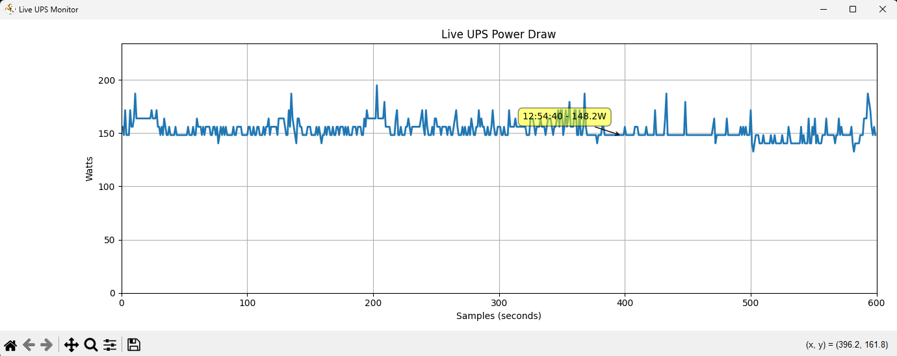

# ups_live_monitor.py

Realtime graph of UPS power draw via USB HID polling on Windows



---

## What?

### ups_live_monitor.py
Polls a UPS (APC-style) over USB HID and renders a live animated graph showing power draw in watts. Useful for visualising UPS behaviour in real-time, including load shifts and connected hardware impact.

- Graphs watt draw using matplotlib
- Calculates power from config-rated watts and percentage load
- Uses `pywinusb` to access raw HID feature reports
- Shows interactive cursor tooltip with timestamp and wattage

### Features:
- Fully live graph
- Horizontal cursor hover to inspect values
- Static power config readout
- Zero-dependency Windows-only solution

---

## Why?
- I needed a quick and dirty script to read my power usage from the ups.
- Just bought a new video card an people thought my PSU was on the low side
- So I, needed to understand how much total power I was pulling
- Built-in UPS software was garbage, total garbage, should be ashamed of themselves, garbage
- Wanted a realtime interactive visual instead of a log so i coult tab back and forth
- FYI, PSU is fine

---

## Usage
Make sure the UPS is connected via USB. Then:
```bash
python ups_live_monitor.py
```

You can modify the script to log to file, run headless for alerts, or display other values like temperature or voltage.

---

## Requirements
- Windows
- Python 3.x
- `pywinusb`
- `matplotlib`
- `mplcursors`

Install requirements:
```bash
pip install pywinusb matplotlib mplcursors
```

---

## Improvements?
- Model testing
- Export data points to CSV
- Add CLI flags for duration or resolution, etc
- Rewrite to support any other platform but Windows

---

## Known Issues
- Apparently some UPS models don't expose ConfigActivePower?

---

## Status
Stable and functional. Ideal for internal use, hacking, and diagnostics.

